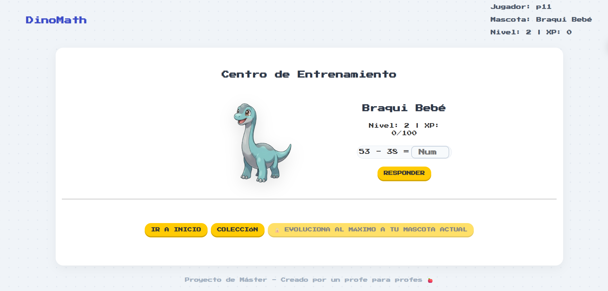

# 🦖 DinoMath (Anteriormente MathsPets) - Aprende Matemáticas Jugando

DinoMath es una aplicación web interactiva y gamificada diseñada para que los niños de primaria practiquen matemáticas mientras crían, entrenan y evolucionan a su propia familia de dinosaurios virtuales.


*Interfaz principal del Centro de Entrenamiento: El dinosaurio evoluciona mientras resuelves retos matemáticos.*

## ✨ Características Principales

* **🥚 Adopción de Dinosaurios:** Los usuarios pueden elegir entre 5 familias prehistóricas basadas en elementos: Rex (Fuego), Triceratops (Tierra), Braquiosaurio (Agua), Pterodáctilo (Aire) y Anquilosaurio (Planta). ¡Todos empiezan como un misterioso huevo!
* **🧮 Centro de Entrenamiento:** Resolviendo operaciones matemáticas generadas dinámicamente, las mascotas ganan Puntos de Experiencia (XP).
* **📈 Progresión y Evoluciones:** Un sistema dinámico de niveles. La mascota evoluciona visualmente y cambia de etapa al alcanzar hitos clave: Huevo (Nvl 1) ➔ Bebé (Nvl 5) ➔ Joven (Nvl 10) ➔ Adulto (Nvl 20).
* **📖 Dinodex (Colección):** Una galería interactiva donde los usuarios pueden ver sus dinosaurios desbloqueados y equiparlos. Los dinosaurios aún no descubiertos aparecen como misteriosas siluetas bloqueadas.
* **☁️ Guardado en la Nube (Auth):** Sistema de registro y login. El progreso de las mascotas (nivel, XP, familia desbloqueada) se sincroniza en tiempo real con una base de datos, permitiendo jugar desde cualquier dispositivo.
* **🎨 Diseño Moderno y Gamificado:** Interfaz "App-like" sin barras de scroll, con tarjetas coleccionables en 3D (CSS Grid avanzado, hover effects y sombreados por capas) totalmente responsiva para móviles, tablets y escritorio.

## 🛠️ Tecnologías Utilizadas

### Frontend (Cliente)
* **React (Vite):** Librería principal para la construcción de la interfaz de usuario.
* **React Router DOM:** Para la navegación ágil entre el Centro de Entrenamiento, la Tienda de Adopción y la Dinodex.
* **Context API & Hooks:** Gestión eficiente y centralizada del estado global de la aplicación (progreso, nivel, sesión de usuario). 
  * **Sin *prop drilling*:** Los datos viajan directamente del Contexto a los componentes que los necesitan, evitando pasarlos en cascada y ensuciar componentes intermedios.
  * **Uso de Estado Derivado:** Evitamos la mala práctica de tener múltiples estados (`useState`) que puedan desincronizarse. Calculamos la información *al vuelo* a partir de una única fuente de verdad. **Por ejemplo:** En el `Dashboard` y en la `Colección`, no guardamos la imagen o el nombre de la evolución en una variable de estado. En su lugar, *derivamos* en tiempo real esa información cruzando el `nivel` actual de la mascota con la base de datos local (`DINODEX`), asegurando que siempre se muestre el dinosaurio correcto (Huevo, Bebé o Adulto) sin bugs de sincronización.
* **React Hook Form:** Para la gestión eficiente y validación del formulario de respuestas matemáticas.
* **CSS3 Avanzado:** Diseño responsivo integral (CSS Grid + Flexbox), animaciones `@keyframes`, y uso avanzado de filtros visuales (`brightness`, `drop-shadow`, `object-fit`) para adaptar las imágenes y crear las siluetas secretas de la Dinodex.


## 🚀 Cómo ejecutar el proyecto en local
Sigue estos pasos para probar la interfaz de DinoMath en tu propio ordenador:

### 1. Clonar y preparar carpeta
1. Clona este repositorio o descomprime el archivo `.zip`.
2. Abre la terminal en la carpeta raíz del proyecto.


### 3. Instalación
Instala las dependencias necesarias ejecutando:
````bash
npm install
````

Arrancar el proyecto en modo desarrollo
````bash
npm run dev
````

## URL de la API del servidor (Backend en Render)
Ejemplo: https://dinomath-backend.onrender.com/api/v1
VITE_API_URL=tu_url_de_render_aqui